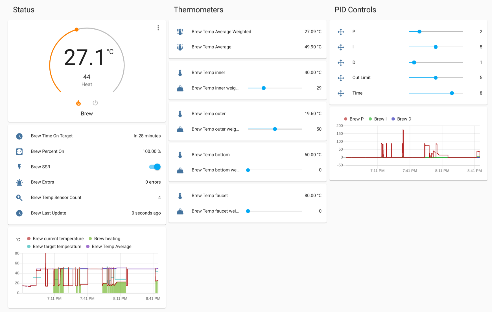

<h1>hass-pid-thermostat</h1>

A PID (climate) controller for [Home Assistant](https://www.home-assistant.io/) to heat something using a thermometer and a SSR relay. Here is an example of a card that shows up in Home Assistant:

<h1>Table of Contents</h1>

- [Setup](#setup)
  - [Home Assistant](#home-assistant)
  - [Deploy with Balena.io](#deploy-with-balenaio)
- [Configuration](#configuration)
- [Home Assistant](#home-assistant-1)
- [Electrical Components](#electrical-components)
  - [Parts I used](#parts-i-used)
  - [Wiring](#wiring)

## Setup

### Home Assistant

Enable [mqtt discovery](https://www.home-assistant.io/docs/mqtt/discovery).

### Deploy with Balena.io

* Add a custom fleet configuration variable in project:
    * `BALENA_HOST_CONFIG_dtoverlay=w1-gpio`
* Add remote your balena remote:
    * `git remote add balena <USERNAME>@git.balena-cloud.com:<USERNAME>/<APPNAME>.git`
* Push to balena:
    * `git push balena master`

## Configuration

| Environmental variable | Required | Default   | Description                                                                                                                  |
| ---------------------- | -------- | --------- | ---------------------------------------------------------------------------------------------------------------------------- |
| LOG_LEVEL              | no       | info      | Log level for application, i.e debug, info, warn, error                                                                      |
| HA_COMPONENT_PREFIX    | no       | Brew      | Prefix for component names                                                                                                   |
| HA_AVAILABLE           | no       | false     | Send available message to HA on startup                                                                                      |
| HA_AUTO                | no       | false     | Send auto discovery messages to HA on startup                                                                                |
| HA_PRINT_CONFIG        | no       | false     | Print HA config on startup                                                                                                   |
| SSR_PIN                | no       | GPIO18    | [Pin name](https://gpiozero.readthedocs.io/en/stable/recipes.html#pin-numbering) on the Raspberry PI the SSR is connected to |
| MQTT_HOST              | no       | localhost | The host of the MQTT server to communicate with HA                                                                           |
| MQTT_USER              | no       |           | MQTT user                                                                                                                    |
| MQTT_PASS              | no       |           | MQTT pass                                                                                                                    |
| PID_P_GAIN             | no       | 2         | PID proportional gain                                                                                                        |
| PID_I_GAIN             | no       | 5         | PID integral gain                                                                                                            |
| PID_D_GAIN             | no       | 1         | PID derivative gain                                                                                                          |
| PID_OUTPUT_LIMIT       | no       | 5         | PID output limit when calculating control percentage                                                                         |
| PID_SAMPLE_TIME        | no       | 8         | Amount of time between each PID update                                                                                       |
| SIMULATE               | no       | false     | Set this to true if you want to simulate thermometer and relays                                                              |
| SLEEP_PER_ITERATION    | no       | 0         | Sleep per loop iteration, useful to set while simulating                                                                     |

## Home Assistant

Component names may differ, but for simulation you can use the [HA config](./hass/configuration.yaml) and [HA dash config](./hass/lovelace.yaml) in this repository.

## Electrical Components

> **_VERY IMPORTANT NOTE:_**  THIS IS NOT A HOW-TO instructional guide. This explains how I used a Raspberry Pi to control electric current. However, I am NOT an electrician, and just because I did something doesn’t mean YOU should, particularly if you are unfamiliar with how to wire electrical devices safely. If you choose to follow the method I used, you do so at your own risk.

### Parts I used

* [Raspberry PI model B](https://www.google.com/search?q=Raspberry+PI+Model+B)
* [Kudom 40 A Solid State Relay](https://www.google.com/search?q=Kudom+40+A+Solid+State+Relay)
* [DS18b20 temperature sensor](https://www.google.com/search?q=ds18b20+temperature+sensor)
* [4.7k ohm resistor](https://www.google.com/search?q=4.7k+ohm+resistor)

### Wiring

