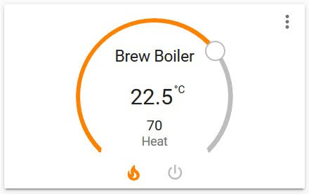
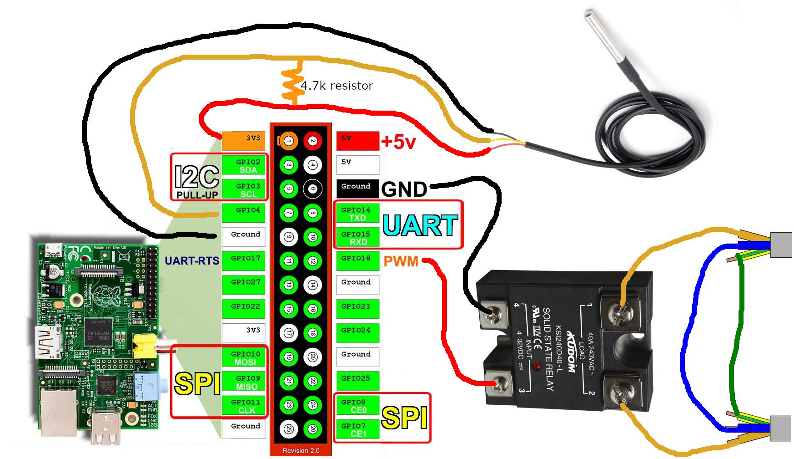
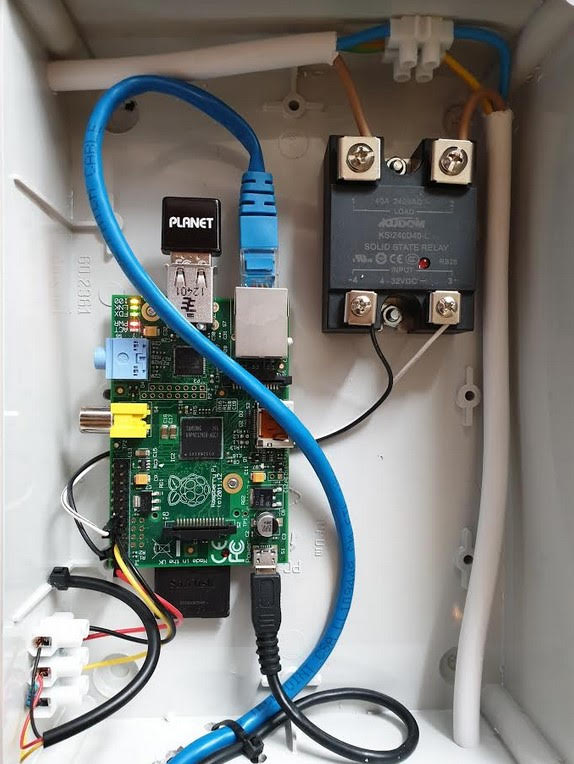

<h1>hass-pid-thermostat</h1>

A PID (climate) controller for [Home Assistant](https://www.home-assistant.io/) to heat/cool something using a thermometer and a SSR relay. Here is an example of a card that shows up in Home Assistant:



## Table of Contents

- [Table of Contents](#table-of-contents)
- [Setup](#setup)
  - [Home Assistant](#home-assistant)
  - [Deploy with Balena.io](#deploy-with-balenaio)
- [Configuration](#configuration)
- [Home Assistant Dashboard](#home-assistant-dashboard)
- [Electrical Components](#electrical-components)
  - [Parts I used](#parts-i-used)
  - [Wiring](#wiring)
  - [End result](#end-result)

## Setup

### Home Assistant

Enable mqtt discovery by adding to HASS config:

```yaml
mqtt:
  broker: localhost # Depends on your setup
  discovery: true
```

### Deploy with Balena.io

* Add a custom fleet configuration variable in project:
    * `BALENA_HOST_CONFIG_dtoverlay=w1-gpio`
* Add remote your balena remote:
    * `git remote add balena <USERNAME>@git.balena-cloud.com:<USERNAME>/<APPNAME>.git`
* Push to balena:
    * `git push balena master`

## Configuration

| Environmental variable | Required | Default      | Description                                                                                                                       |
| ---------------------- | -------- | ------------ | --------------------------------------------------------------------------------------------------------------------------------- |
| LOG_LEVEL              | no       | info         | Log level for application, i.e debug, info, warn, error                                                                           |
| COMPONENT_ID           | no       | boiler       | Id for component in hass.io                                                                                                       |
| COMPONENT_MODE         | no       | heat         | Mode of the component, it can be in `heat` mode hooked up to a heating element or `cool` mode when hooked up to a cooling element |
| COMPONENT_NAME         | no       | Boiler       | Name that show up in the hass.io UI                                                                                               |
| BOIL_ELEMENT_PIN       | no       | GPIO18       | [Pin name](https://gpiozero.readthedocs.io/en/stable/recipes.html#pin-numbering) on the Raspberry PI the heater is connected to   |
| PUMP_ELEMENT_PIN       | no       | GPIO24       | [Pin name](https://gpiozero.readthedocs.io/en/stable/recipes.html#pin-numbering) on the Raspberry PI the pump is connected to     |
| MQTT_HOST              | no       | hassio.local | The host of the MQTT server to communicate with hass.io                                                                           |
| MQTT_USER              | no       |              | MQTT user                                                                                                                         |
| MQTT_PASS              | no       |              | MQTT pass                                                                                                                         |
| PID_P_GAIN             | no       | 5            | PID proportional gain                                                                                                             |
| PID_I_GAIN             | no       | 0            | PID integral gain                                                                                                                 |
| PID_D_GAIN             | no       | 2            | PID derivative gain                                                                                                               |
| PID_SAMPLE_TIME        | no       | 8            | Amount of time between each PID update                                                                                            |
| SIMULATE               | no       | false        | Set this to true if you want to simulate thermometer and relays                                                                   |

## Home Assistant Dashboard

You can paste this view into Home Assistant to setup the dashboard.

```yaml
views:
  - icon: 'mdi:glass-mug-variant'
    path: beer-making
    title: Beer Making
    cards:
      - entity: climate.boiler
        type: thermostat
      - type: entities
        entities:
          - entity: switch.boiler_pump
          - entity: switch.boiler_heater
          - entity: sensor.boiler_pid_time_on
      - cards:
          - entities:
              - entity: climate.boiler
            hours_to_show: 1
            refresh_interval: 5
            type: history-graph
          - entities:
              - entity: sensor.boiler_pid_p
              - entity: sensor.boiler_pid_i
              - entity: sensor.boiler_pid_d
            hours_to_show: 1
            refresh_interval: 5
            type: history-graph
        type: vertical-stack
      - cards:
          - entity: sensor.boiler_pid_p_gain
            name: P
            type: sensor
          - entity: sensor.boiler_pid_i_gain
            name: I
            type: sensor
          - entity: sensor.boiler_pid_d_gain
            name: D
            type: sensor
        title: PID Gain
        type: horizontal-stack
      - cards:
          - entity: sensor.boiler_pid_time_interval
            name: Interval
            type: sensor
          - entity: sensor.boiler_pid_output_lower
            name: Lower
            type: sensor
          - entity: sensor.boiler_pid_output_upper
            name: Upper
            type: sensor
        title: PID Params
        type: horizontal-stack
```

## Electrical Components

> **_VERY IMPORTANT NOTE:_**  THIS IS NOT A HOW-TO instructional guide. This explains how I used a Raspberry Pi to control electric current. However, I am NOT an electrician, and just because I did something doesn’t mean YOU should, particularly if you are unfamiliar with how to wire electrical devices safely. If you choose to follow the method I used, you do so at your own risk.

### Parts I used

* [Raspberry PI model B](https://www.google.com/search?q=Raspberry+PI+Model+B)
* [Kudom 40 A Solid State Relay](https://www.google.com/search?q=Kudom+40+A+Solid+State+Relay)
* [DS18b20 temperature sensor](https://www.google.com/search?q=ds18b20+temperature+sensor)
* [4.7k ohm resistor](https://www.google.com/search?q=4.7k+ohm+resistor)

### Wiring



### End result


